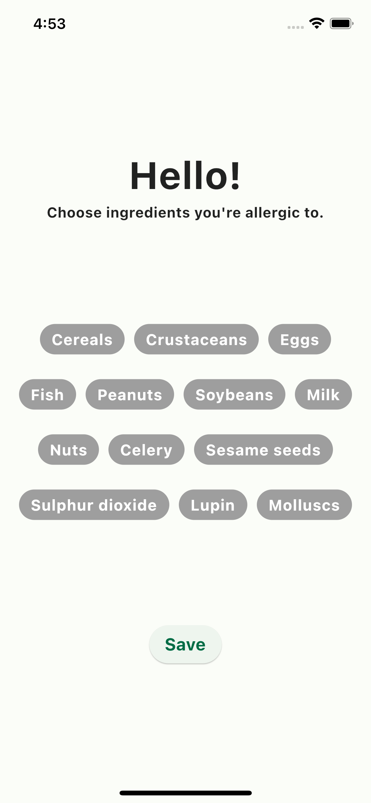
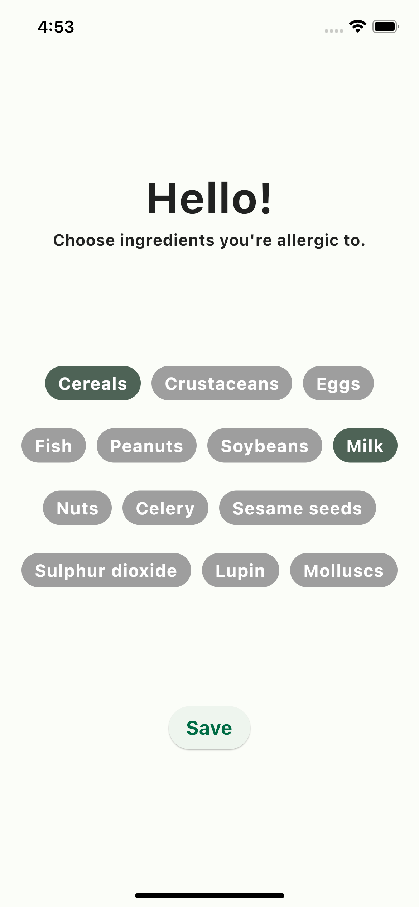
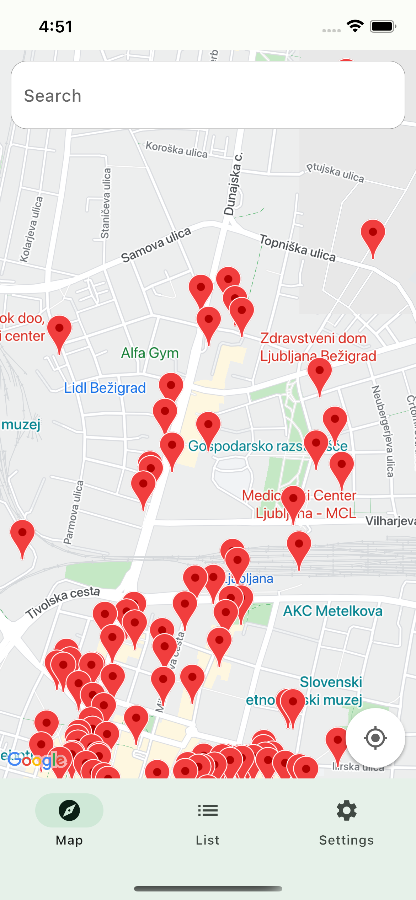
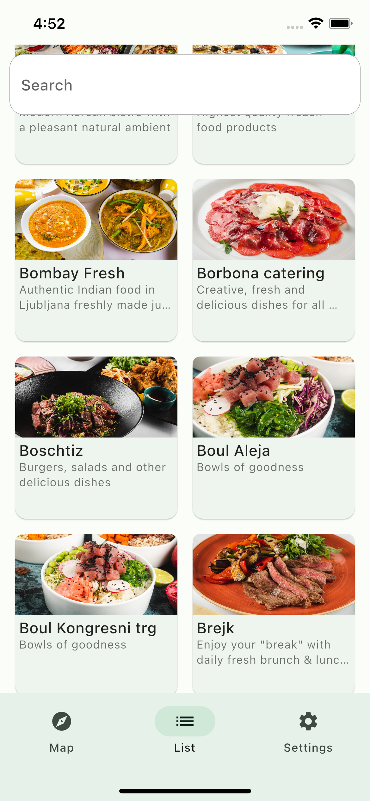
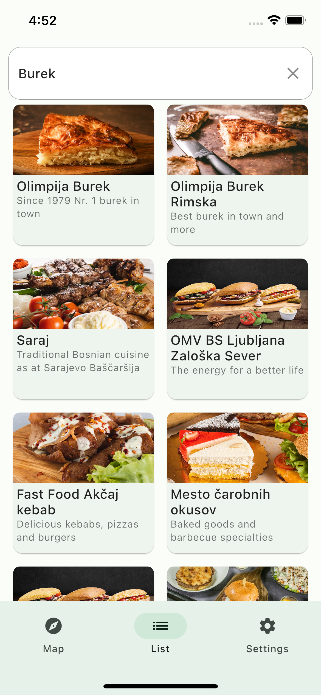
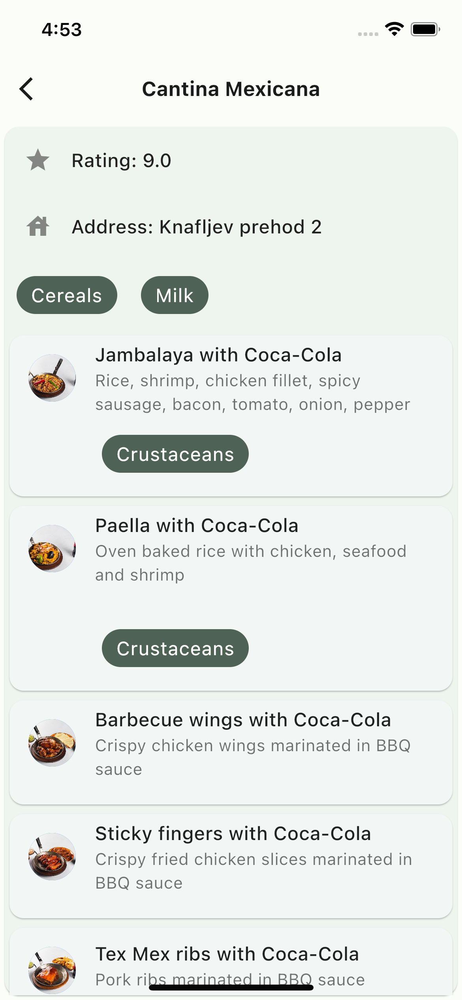
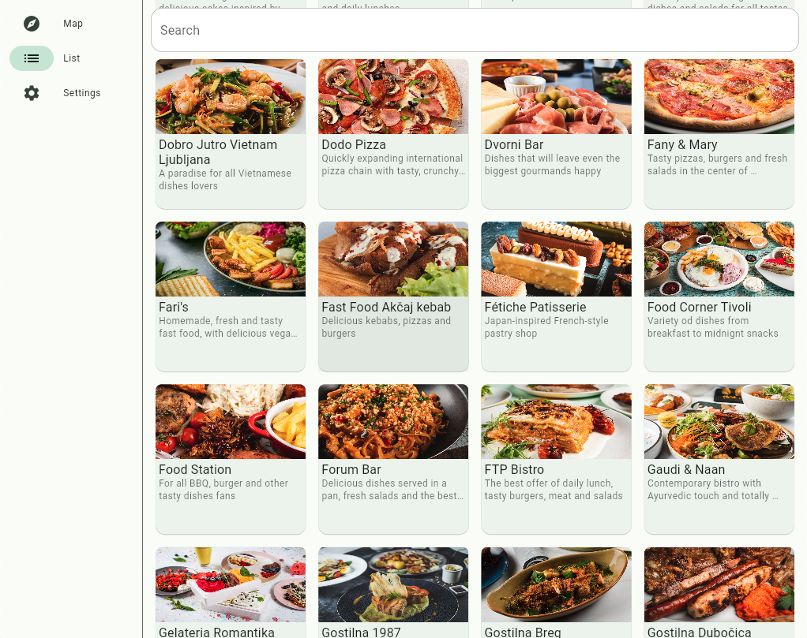
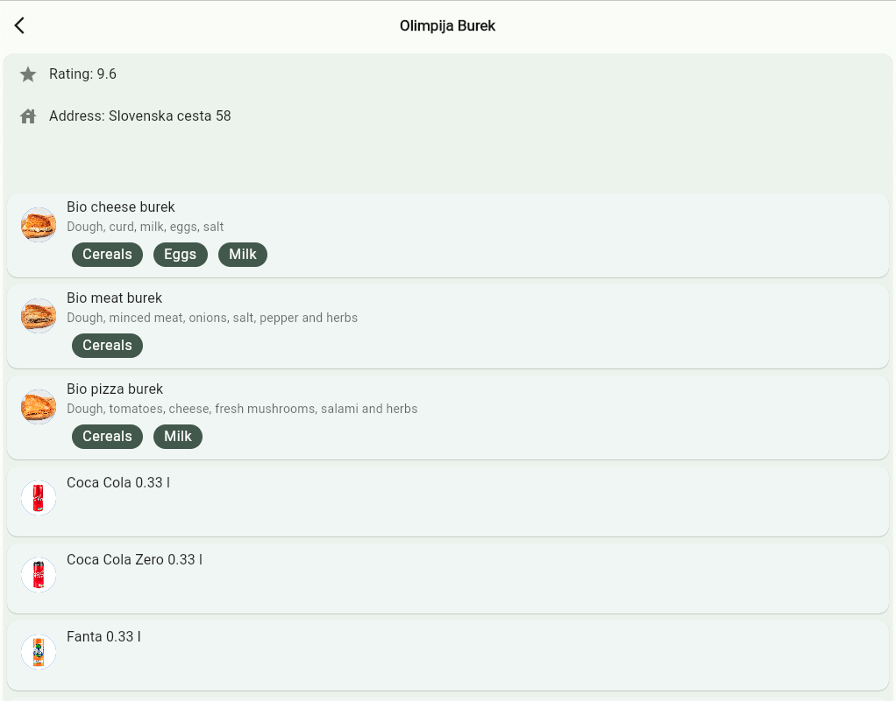

# Allergone

Allergone is our Dragonhack 2022 submission that won Best Code Quality challenge.
Allergone helps people with food allergies find places to eat. Using natural language processing, Allergone extracts allergen information from restaurants' menus. People with allergies can finally find places to eat using a mobile or web app.

## Screenshots

### Mobile app

### Web app

## Project architecture

The following technologies are used:
- [flutter framework](https://flutter.dev) for frontend
- [django](https://www.djangoproject.com/) for backend
- [postgresql](https://www.postgresql.org/) for database
- [meilisearch](https://www.meilisearch.com/) for full text search
- [Google Maps API](https://developers.google.com/maps/apis-by-platform) for displaying restaurants on the map

Project is separated into [frontend](https://github.com/zerodays/dragonhack-2022-1/tree/master/frontend) and [backend](https://github.com/zerodays/dragonhack-2022-1/tree/master/backend). More info for each component is located in its directory.
